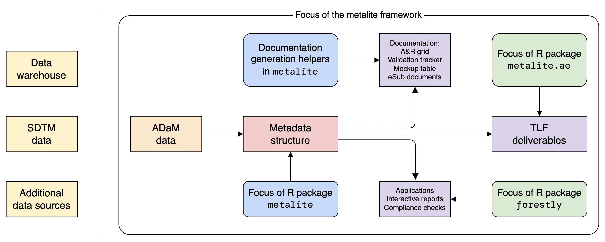

# metalite 

<!-- badges: start -->

[](https://CRAN.R-project.org/package=metalite)
[](https://app.codecov.io/gh/Merck/metalite?branch=main)
[](https://CRAN.R-project.org/package=metalite)
[](https://github.com/Merck/metalite/actions/workflows/R-CMD-check.yaml)
[](https://cran.r-project.org/package=metalite)

<!-- badges: end -->

Unified representation of metadata structure for
clinical analysis & reporting (A&R) by leveraging the
Analysis Data Model (ADaM) datasets.



## Installation

The easiest way to get metalite is to install from CRAN:

```r
install.packages("metalite")
```

Alternatively, to use a new feature or get a bug fix,
you can install the development version of metalite from GitHub:

```r
# install.packages("remotes")
remotes::install_github("Merck/metalite")
```

## Overview

The metalite framework is designed to:

- Standardize function input for analysis and reporting.
- Separate analysis logic from data source.
- Enable the use of pipes (`|>`).
- Reduce manual steps to develop and maintain documentation in clinical trial development.
- Ensure consistency between analysis specification, mock, and results.

## Use cases

The metalite package offers a foundation to simplify tool development
and create standard engineering workflows.
For example, metalite can be used to:

- Standardize input and output for A&R functions.
- Create analysis and reporting planning grid.
- Create mock table.
- Create and validate A&R results.
- Trace analysis records.

Note: metalite is a low-level R package
that needs to work with other R packages to complete the work.
The idea is illustrated in the diagram above.

## Design principles

We built metalite with the following principles:

- Automation: prefer a function call more than a checklist.
- Single-entry: enter in one place, sync to all deliveries.
  - For example, enter data source one time for all AE analysis.
- End-to-end: cover all steps in software development lifecycle (SDLC) from define to delivery.
