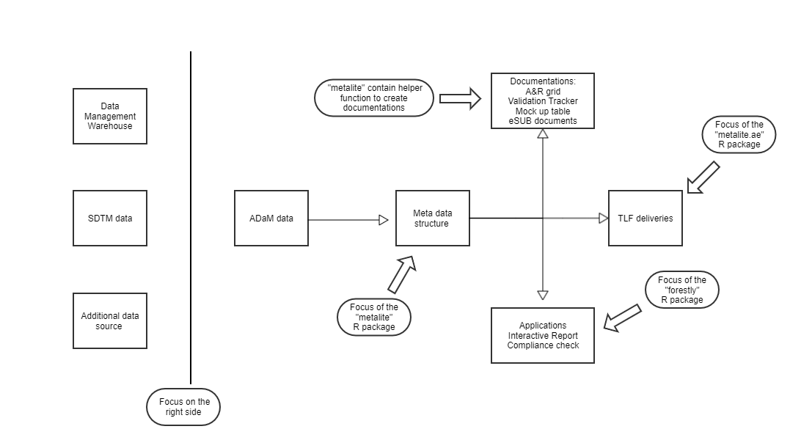

# metalite

# Overview

The purpose of `metalite` is to define a unified data structure to save meta information 
for analysis & reporting (A&R) based on ADaM datasets in clinical trial development. 

The R package is design to 

- standardize function input for analysis and reporting. 
- enables pipes (`|>`).
- reduce manual steps to maintain SDLC documentation.
- ensure consistency between analysis specification, mock and results.

We build `metalite` to enable principals below:

- Automation: a function call is better than a checklist. 
- Single-entry: enter in one place, sync to all delivery. 
  - e.g. Enter data source one time for all AE analysis.
- End-to-end: cover all steps in SDLC from define to delivery.

# Use cases 

`metalite` build a foundation to simplify tool development. 
For example, `metalite` can be used to: 

- standardize input and output for A&R functions. 
- create A&R grid 
- create mock table 
- create and validate A&R results
- trace analysis records 

`metalite` need to work with other R packages to complete the work. 
We illustrate the idea in the diagram below.

