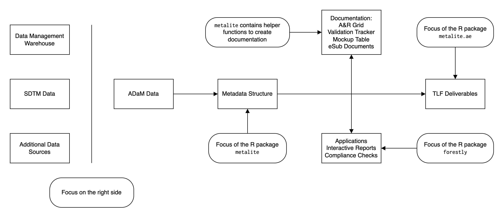

# Introduction to metalite

``` r

library(metalite)
library(r2rtf)
```

## Overview

The purpose of metalite is to unify the data structure for saving
metadata information in clinical analysis & reporting (A&R), leveraging
the Analysis Data Model (ADaM) datasets for consistent and accurate
metadata representation.

The metalite framework is designed to:

- Standardize function input for analysis and reporting.
- Enable the use of pipes (`|>`).
- Reduce manual steps to maintain SDLC documentation.
- Ensure consistency between analysis specification, mock, and results.

We built metalite with the following principles:

- Automation: prefer a function call more than a checklist.
- Single-entry: enter in one place, sync to all deliveries.
  - For example, enter data source one time for all AE analysis.
- End-to-end: cover all steps in software development lifecycle (SDLC)
  from define to delivery.

## Use cases

The metalite package offers a foundation to simplify tool development
and create standard engineering workflows. For example, metalite can be
used to:

- Standardize input and output for A&R functions.
- Create analysis and reporting planning grid.
- Create mock table.
- Create and validate A&R results.
- Trace analysis records.

metalite needs to work with other R packages to complete the work. The
idea is illustrated in the diagram below.



## Mental model

The typical analysis and reporting based on ADaM data contain three
layers.

- Data
- Analysis plan
- Analysis metadata

The design of metalite is to align the layers using `meta_adam` and
`define_xxx` functions.

### Example: adverse events analysis

We use a simplified adverse events analysis as an example to illustrate
the mental model.

- Data
  ([`meta_adam()`](https://merck.github.io/metalite/reference/meta_adam.md)):
  - Observation level: ADAE
  - Population level: ADSL

For a typical adverse events analysis, the AE records is saved in ADAE
(observation level) and the population information is saved in ADSL
(population level). With demo ADaM datasets in r2rtf package, we can
construct an object as below using
[`meta_adam()`](https://merck.github.io/metalite/reference/meta_adam.md).

``` r

meta_adam(
  observation = r2rtf_adae,
  population = r2rtf_adsl
)
#> ADaM metadata: 
#>    .$data_population     Population data with 254 subjects 
#>    .$data_observation    Observation data with 1191 records
```

- Analysis Plan
  ([`define_plan()`](https://merck.github.io/metalite/reference/define_plan.md)):
  specification of analysis
  - A&R grid
  - validation tracker
  - mock table

We also need to understand the analysis plan for the adverse events
analysis. Specifically, the details of each table, listing and figure
(TLF)

Here we use two helper functions
([`plan()`](https://merck.github.io/metalite/reference/plan.md) and
[`add_plan()`](https://merck.github.io/metalite/reference/add_plan.md))
to create an analysis plan. The analysis plan is a data frame that
indicate the specification of each TLF. In the code below, we construct
10 TLFs based on different combination of analysis function, population,
observation and parameter.

``` r

plan <- plan(
  analysis = "ae_summary", population = "apat",
  observation = c("wk12", "wk24"), parameter = "any;rel;ser"
) |>
  add_plan(
    analysis = "ae_specific", population = "apat",
    observation = c("wk12", "wk24"),
    parameter = c("any", "aeosi", "rel", "ser")
  )

plan
#>    mock    analysis population observation   parameter
#> 1     1  ae_summary       apat        wk12 any;rel;ser
#> 2     1  ae_summary       apat        wk24 any;rel;ser
#> 3     2 ae_specific       apat        wk12         any
#> 4     2 ae_specific       apat        wk24         any
#> 5     2 ae_specific       apat        wk12       aeosi
#> 6     2 ae_specific       apat        wk24       aeosi
#> 7     2 ae_specific       apat        wk12         rel
#> 8     2 ae_specific       apat        wk24         rel
#> 9     2 ae_specific       apat        wk12         ser
#> 10    2 ae_specific       apat        wk24         ser
```

Then, we can define the analysis plan using
[`define_plan()`](https://merck.github.io/metalite/reference/define_plan.md).

``` r

meta_adam(
  population = r2rtf_adsl,
  observation = r2rtf_adae
) |>
  define_plan(plan)
#> ADaM metadata: 
#>    .$data_population     Population data with 254 subjects 
#>    .$data_observation    Observation data with 1191 records 
#>    .$plan    Analysis plan with 10 plans
```

- Analysis metadata:
  - population
    ([`define_population()`](https://merck.github.io/metalite/reference/define_population.md)):
    e.g.: `name = "apat", group = "TRT01A", subset = SAFFL == "Y"`
  - observation
    ([`define_observation()`](https://merck.github.io/metalite/reference/define_observation.md)):
    e.g.:
    `name = "wk12", group = "TRTA", subset = SAFFL == "Y", label = "Weeks 0 to 12"`
  - parameter
    ([`define_parameter()`](https://merck.github.io/metalite/reference/define_parameter.md)):
    e.g.:
    `name = "ser", subset = AESER == "Y", label = "serious adverse events"`
  - analysis
    ([`define_analysis()`](https://merck.github.io/metalite/reference/define_analysis.md)):
    AE summary, Specific AE table, Rainfall plot (static or
    interactive), Volcano plot, etc.

There are more details that needs to be defined in the metadata
information. For example, how to select the APaT population from the
`ADSL` dataset. This is achieved by defining the population. We have
defined some built-in information that follows an A&R conventions. So,
the programs know the meaning of `apat` as below.

``` r

meta_adam(
  population = r2rtf_adsl,
  observation = r2rtf_adae
) |>
  define_plan(plan) |>
  define_population(name = "apat")
#> ADaM metadata: 
#>    .$data_population     Population data with 254 subjects 
#>    .$data_observation    Observation data with 1191 records 
#>    .$plan    Analysis plan with 10 plans 
#> 
#> 
#>   Analysis population type:
#>     name        id group var subset                         label
#> 1 'apat' 'USUBJID'                  'All Participants as Treated'
```

Some project specific information still needs to be provided by study
team such as the group variable name and subset flag condition.

``` r

meta_adam(
  population = r2rtf_adsl,
  observation = r2rtf_adae
) |>
  define_plan(plan) |>
  define_population(
    name = "apat",
    group = "TRT01A",
    subset = SAFFL == "Y"
  )
#> ADaM metadata: 
#>    .$data_population     Population data with 254 subjects 
#>    .$data_observation    Observation data with 1191 records 
#>    .$plan    Analysis plan with 10 plans 
#> 
#> 
#>   Analysis population type:
#>     name        id    group var       subset                         label
#> 1 'apat' 'USUBJID' 'TRT01A'     SAFFL == 'Y' 'All Participants as Treated'
```

Similarly, we can define other meta information for analysis
observation, parameter and function. We will also use
[`meta_build()`](https://merck.github.io/metalite/reference/meta_build.md)
to add default values for other `name` that is not specified.

> In metalite, we saved this demo in
> [`meta_example()`](https://merck.github.io/metalite/reference/meta_example.md)
> to illustrate different use cases.

``` r

meta_adam(
  population = r2rtf_adsl,
  observation = r2rtf_adae
) |>
  define_plan(plan = plan) |>
  define_population(
    name = "apat",
    group = "TRT01A",
    subset = SAFFL == "Y"
  ) |>
  define_observation(
    name = "wk12",
    group = "TRTA",
    subset = SAFFL == "Y",
    label = "Weeks 0 to 12"
  ) |>
  define_observation(
    name = "wk24",
    group = "TRTA",
    subset = AOCC01FL == "Y", # just for demo, another flag shall be used.
    label = "Weeks 0 to 24"
  ) |>
  define_parameter(
    name = "rel",
    subset = AEREL %in% c("POSSIBLE", "PROBABLE")
  ) |>
  define_parameter(
    name = "aeosi",
    subset = AEOSI == "Y",
    label = "adverse events of special interest"
  ) |>
  define_analysis(
    name = "ae_summary",
    title = "Summary of Adverse Events"
  ) |>
  meta_build()
#> ADaM metadata: 
#>    .$data_population     Population data with 254 subjects 
#>    .$data_observation    Observation data with 1191 records 
#>    .$plan    Analysis plan with 10 plans 
#> 
#> 
#>   Analysis population type:
#>     name        id    group var       subset                         label
#> 1 'apat' 'USUBJID' 'TRT01A'     SAFFL == 'Y' 'All Participants as Treated'
#> 
#> 
#>   Analysis observation type:
#>     name        id  group var          subset           label
#> 1 'wk12' 'USUBJID' 'TRTA'        SAFFL == 'Y' 'Weeks 0 to 12'
#> 2 'wk24' 'USUBJID' 'TRTA'     AOCC01FL == 'Y' 'Weeks 0 to 24'
#> 
#> 
#>   Analysis parameter type:
#>      name                                label
#> 1   'rel'        'drug-related adverse events'
#> 2 'aeosi' 'adverse events of special interest'
#> 3   'any'                 'any adverse events'
#> 4   'ser'             'serious adverse events'
#>                                 subset
#> 1 AEREL %in% c('POSSIBLE', 'PROBABLE')
#> 2                         AEOSI == 'Y'
#> 3                                     
#> 4                         AESER == 'Y'
#> 
#> 
#>   Analysis function:
#>            name                           label
#> 1  'ae_summary'  'Table: adverse event summary'
#> 2 'ae_specific' 'Table: specific adverse event'
```

As a developer, you can reuse those meta information for your
development. It also allow developers to **standardize** the input of
their functions. So the `plan$analysis` is analysis name. `meta` and
other columns in
[`plan()`](https://merck.github.io/metalite/reference/plan.md) are
function arguments

``` r

ae_summary(
  meta,
  population,
  observation,
  parameter, ...
)
```
