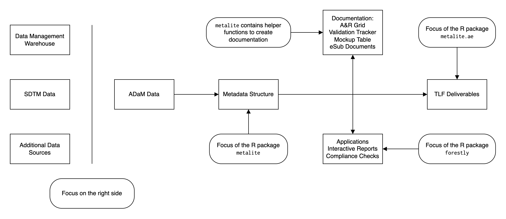

```{r, echo = FALSE, message = FALSE, include = FALSE}
knitr::opts_chunk$set(
  collapse = TRUE,
  comment = "#>",
  out.width = "100%"
)
```

```{r, message = FALSE}
library(metalite)
library(r2rtf)
```

# Overview

The purpose of metalite is to unify the data structure for saving
metadata information in clinical analysis & reporting (A&R), leveraging the
Analysis Data Model (ADaM) datasets for
consistent and accurate metadata representation.

The metalite framework is designed to:

- Standardize function input for analysis and reporting.
- Enable the use of pipes (`|>`).
- Reduce manual steps to maintain SDLC documentation.
- Ensure consistency between analysis specification, mock, and results.

We built metalite with the following principles:

- Automation: prefer a function call more than a checklist.
- Single-entry: enter in one place, sync to all deliveries.
  - For example, enter data source one time for all AE analysis.
- End-to-end: cover all steps in software development lifecycle (SDLC) from define to delivery.

# Use cases

The metalite package offers a foundation to simplify tool development
and create standard engineering workflows.
For example, metalite can be used to:

- Standardize input and output for A&R functions.
- Create analysis and reporting planning grid.
- Create mock table.
- Create and validate A&R results.
- Trace analysis records.

metalite needs to work with other R packages to complete the work.
The idea is illustrated in the diagram below.

```{r, echo = FALSE, out.width = "100%", fig.align = "center"}

```

# Mental model

The typical analysis and reporting based on ADaM data contain three layers.

- Data
- Analysis plan
- Analysis metadata

The design of metalite is to align the layers using `meta_adam` and `define_xxx` functions.

## Example: adverse events analysis

We use a simplified adverse events analysis as an example to illustrate the mental model.

- Data (`meta_adam()`):
  - Observation level: ADAE
  - Population level:  ADSL

For a typical adverse events analysis,
the AE records is saved in ADAE (observation level) and
the population information is saved in ADSL (population level).
With demo ADaM datasets in r2rtf package, we can construct an object as below using `meta_adam()`.

```{r}
meta_adam(
  observation = r2rtf_adae,
  population = r2rtf_adsl
)
```

- Analysis Plan (`define_plan()`): specification of analysis
  - A&R grid
  - validation tracker
  - mock table

We also need to understand the analysis plan for the adverse events analysis.
Specifically, the details of each table, listing and figure (TLF)

Here we use two helper functions (`plan()` and `add_plan()`) to create an analysis plan.
The analysis plan is a data frame that indicate the specification of each TLF.
In the code below, we construct 10 TLFs based on different combination of
analysis function, population, observation and parameter.

```{r}
plan <- plan(
  analysis = "ae_summary", population = "apat",
  observation = c("wk12", "wk24"), parameter = "any;rel;ser"
) |>
  add_plan(
    analysis = "ae_specific", population = "apat",
    observation = c("wk12", "wk24"),
    parameter = c("any", "aeosi", "rel", "ser")
  )

plan
```

Then, we can define the analysis plan using `define_plan()`.

```{r}
meta_adam(
  population = r2rtf_adsl,
  observation = r2rtf_adae
) |>
  define_plan(plan)
```

- Analysis metadata:
  - population (`define_population()`): e.g.: `name = "apat", group = "TRT01A", subset = SAFFL == "Y"`
  - observation (`define_observation()`): e.g.: `name = "wk12", group = "TRTA", subset = SAFFL == "Y", label = "Weeks 0 to 12"`
  - parameter (`define_parameter()`): e.g.: `name = "ser", subset = AESER == "Y", label = "serious adverse events"`
  - analysis (`define_analysis()`): AE summary, Specific AE table, Rainfall plot (static or interactive), Volcano plot, etc.

There are more details that needs to be defined in the metadata information.
For example, how to select the APaT population from the `ADSL` dataset.
This is achieved by defining the population.
We have defined some built-in information that follows an A&R conventions.
So, the programs know the meaning of `apat` as below.

```{r}
meta_adam(
  population = r2rtf_adsl,
  observation = r2rtf_adae
) |>
  define_plan(plan) |>
  define_population(name = "apat")
```

Some project specific information still needs to be provided by study team
such as the group variable name and subset flag condition.

```{r}
meta_adam(
  population = r2rtf_adsl,
  observation = r2rtf_adae
) |>
  define_plan(plan) |>
  define_population(
    name = "apat",
    group = "TRT01A",
    subset = SAFFL == "Y"
  )
```

Similarly, we can define other meta information
for analysis observation, parameter and function.
We will also use `meta_build()` to add default values for other `name` that is not specified.

> In metalite, we saved this demo in `meta_example()` to illustrate
> different use cases.

```{r}
meta_adam(
  population = r2rtf_adsl,
  observation = r2rtf_adae
) |>
  define_plan(plan = plan) |>
  define_population(
    name = "apat",
    group = "TRT01A",
    subset = SAFFL == "Y"
  ) |>
  define_observation(
    name = "wk12",
    group = "TRTA",
    subset = SAFFL == "Y",
    label = "Weeks 0 to 12"
  ) |>
  define_observation(
    name = "wk24",
    group = "TRTA",
    subset = AOCC01FL == "Y", # just for demo, another flag shall be used.
    label = "Weeks 0 to 24"
  ) |>
  define_parameter(
    name = "rel",
    subset = AEREL %in% c("POSSIBLE", "PROBABLE")
  ) |>
  define_parameter(
    name = "aeosi",
    subset = AEOSI == "Y",
    label = "adverse events of special interest"
  ) |>
  define_analysis(
    name = "ae_summary",
    title = "Summary of Adverse Events"
  ) |>
  meta_build()
```

As a developer, you can reuse those meta information for your development.
It also allow developers to **standardize** the input of their functions.
So the `plan$analysis` is analysis name. `meta` and other columns in `plan()` are function arguments

```{r, eval = FALSE}
ae_summary(
  meta,
  population,
  observation,
  parameter, ...
)
```
